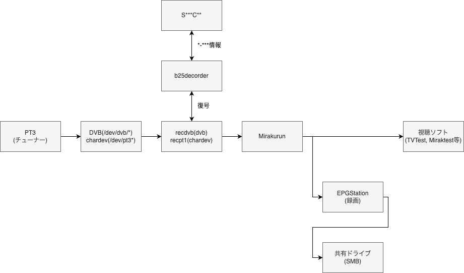

# Docker-ISDB-IPBrodcastTest

研究のためLinuxホスト上でDockerでPT3で[Mirakurun](https://github.com/Chinachu/Mirakurun) でデジタル放送をIPでLAN内に配信するテストをしてみた。
2年近く前に作成したものなので環境は適宜調整してください

このリポジトリは研究目的のために作成されたものです。ご利用は自己責任で。


## 実行環境

- Hyper Visor: Proxmox VE
- Host: Ubuntu Server 20.04 LTS
- Docker: 20.10
- docker-compose: 1.27
- Tuner: PT3

### 動作を確認したクライアント

研究のため以下のクライアントで動作を確認しました。

- EPGStation
- Miraktest
- TVTest


## やりたいこと(要件)

- PT3 で受信した地デジ放送を Mirakurun で再配信し､EPGStation で録画できる環境がある
- PT3 と Mirakurun を受け持つ recpt1 で､b25 の複合ができる
- S***C** が利用できる(*-*** を使用しない)
- Mirakurun で配信した放送を Mac 及び TVTest で視聴できる
- 録画した映像は SMB で共有される
- これらの環境が Docker で提供されている

## ホスト側構築

```bash
sudo apt-get update
sudo apt-get -y install curl

# docker
curl -fsSL https://get.docker.com/ | sh
curl -fsSL https://get.docker.com/gpg | sudo apt-key add

# docker-compose
sudo curl -L https://github.com/docker/compose/releases/download/1.29.2/docker-compose-`uname -s`-`uname -m` -o /usr/local/bin/docker-compose
sudo chmod +x /usr/local/bin/docker-compose
```

```bash
# Add user
adduser tv-server
usermod -a -G sudo tv-server
usermod -a -G docker tv-server
```

```bash
git clone https://github.com/gretchi/tv-server.git
git submodule init
git submodule update
```

```bash
# OS 標準インストールドライバを無効化
echo 'blacklist earth-pt3' | sudo tee -a /etc/modprobe.d/blacklist.conf
```

```bash
# ドライバのビルドとインストール
sudo apt install dkms

cd ./driver/pt3
make
sudo make install
sudo ${SHELL} ./dkms.install
```

```bash
sudo reboot now
```

```bash
# イメージビルド
docker-compose build

# Systemd
ln -s /home/tv-server/tv-server/systemd/tv-server.service /usr/lib/systemd/system/tv-server.service
sudo systemctl daemon-reload

systemctl enable tv-server.service
systemctl start tv-server.service
```

## 付録

### 参照リンク

- https://github.com/m-tsudo/pt3
- https://github.com/stz2012/recpt1
- https://github.com/stz2012/libarib25
- https://github.com/Chinachu/Mirakurun
- https://github.com/l3tnun/EPGStation
- https://www.maspro.co.jp/contact/channel.pdf

### 考察

```plaintext
PCSC:
    スマートカードのサービス?
    pcscd:
        サーバ
    pcsc-tools:
        クライアント
S***C**:
    *-*** を不要にするDLL
b25:
    ARIB STD-B25
libarib25:
    multi2 を復号するツール(ライブラリ形式？)
        PCSC/winscard.h が pcsclite.h を include してる
        -> libpcsclite.so.1.0.0 が必要？
        -> S***C** と同じコンテナでビルドする必要あり？
recpt1:
    PT1(PTx)をLinuxで使うためのツール
    事実上の標準インターフェースになってるっぽい？
recdvb:
    recpt1のDVB版
Mirakurun:
    Windowsにおけるspinelみたいなもの？
    APIで提供されている
Chinchu:
    DVRソフト
EPGStation:
    DVRソフト
DVB:
    デジタルテレビ放送の規格
    DVBデバイス
    Ubuntu 20.04 では PT3 用の dvb ドライバが提供されている
    Docker版 Mirakurun はdvbドライバを利用する
        S***C** + b25decorder でのデコードはrecpt1が担う為､標準ドライバは使えない？
Ubuntu 20.04 LTS:
    PT3 用のドライバの有無、 Debian と CentOS では PCSC が上手く動かなかった
```

## 構成図


